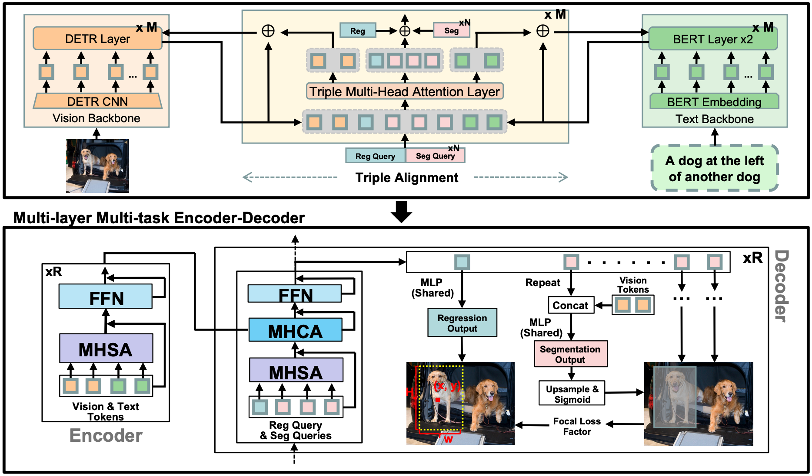

# SegVG
<p align="center">  </p>

## **Introduction**


This repository is an official PyTorch implementation of the ECCV 2024 paper [**SegVG: Transferring Object Bounding Box to Segmentation for Visual Grounding**](https://arxiv.org/abs/2407.03200). Our **SegVG** transfers the box-level annotation as **Seg**mentation signals to provide an additional pixel-level supervision for **V**isual **G**rounding.
Additionally, the query, text, and vision tokens are triangularly updated to mitigate domain discrepancy by our proposed Triple Alignment module.
Please cite our paper if the paper or codebase is helpful to you.

    @article{kang2024segvg,
        title={Segvg: Transferring object bounding box to segmentation for visual grounding},
        author={Kang, Weitai and Liu, Gaowen and Shah, Mubarak and Yan, Yan},
        journal={arXiv preprint arXiv:2407.03200},
        year={2024}}

### Installation
1.  Clone this repository.
    ```
    git clone https://github.com/WeitaiKang/SegVG.git
    ```

2.  Prepare for environment. 

    Please refer to [`ReSC`](https://github.com/zyang-ur/ReSC) for setting up environment. We use the 1.12.1+cu116 version pytorch. 

3.  Prepare for data. 

    Please download the coco train2014 [`images`](http://images.cocodataset.org/zips/train2014.zip).
    
     Please download the referring expression annotations from the 'annotation' directory of [`SegVG`](https://drive.google.com/drive/u/0/folders/1oKrM8NefV6F18Lkli092vstdTtPPwlwj). 

    Please download the [`ResNet101`](https://drive.google.com/drive/folders/17CVnc5XOyqqDlg1veXRE9hY9r123Nvqx) ckpts of vision backbone from TransVG.

    You can place them wherever you want. Just remember to set the paths right in your train.sh and test.sh.

### Model Zoo

Our model ckpts are available in the 'ckpt' directory of [`SegVG`](https://drive.google.com/drive/u/0/folders/1oKrM8NefV6F18Lkli092vstdTtPPwlwj).

- **RefCOCO**

| Model   | val     | testA  | testB  |
|---------|---------|--------|--------|
| SegVG   | 86.84   | 89.46  | 83.07  |

- **RefCOCO+**

| Model   | val     | testA  | testB  |
|---------|---------|--------|--------|
| SegVG   | 77.18   | 82.63  | 67.59  |

- **RefCOCOg**

| Model   | val-g   | val-u  | test-u |
|---------|---------|--------|--------|
| SegVG   | 76.01   | 78.35  | 77.42  |

- **ReferItGame**

| Model   | test    |
|---------|---------|
| SegVG   | 75.59   |

### Training and Evaluation

1.  Training
    ```
    bash train.sh
    ```
    Please take a look of [`train.sh`](https://github.com/WeitaiKang/SegVG/blob/0ad3c7e1bf47871f88a74bdebfd635f8e461f744/train.sh) to set the parameters.

2.  Evaluation
    ```
    bash test.sh
    ```
    Please take a look of [`test.sh`](https://github.com/WeitaiKang/SegVG/blob/0ad3c7e1bf47871f88a74bdebfd635f8e461f744/test.sh) to set the parameters.

### Acknowledge
This codebase is partially based on [`TransVG`](https://github.com/djiajunustc/TransVG?tab=readme-ov-file).
